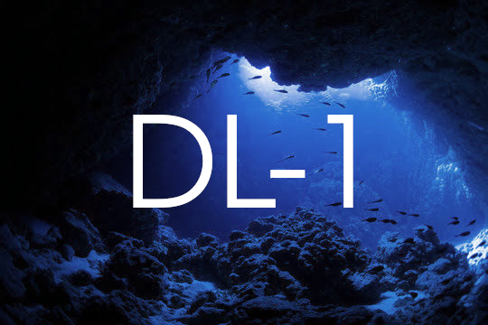

# Курс "Глубинное обучение (ГО) 1 / Введение в ГО" на ФКН ВШЭ

  

## Версии курса прошлых лет

* [2021-2022](https://github.com/xiyori/intro-to-dl-hse/tree/2021-2022)
* [2022-2023](https://github.com/xiyori/intro-to-dl-hse/tree/2022-2023)
* [2023-2024](https://github.com/xiyori/intro-to-dl-hse/tree/2023-2024)
* [2024-2025](https://github.com/xiyori/intro-to-dl-hse/tree/2024-2025)
* [2025-2026](https://github.com/xiyori/intro-to-dl-hse/tree/2024-2025)

## Полезные ссылки

* [Вики-страничка](http://wiki.cs.hse.ru/Глубинное_обучение_1_26/27)
* [Таблица с оценками](???)
* [Плейлист с записями занятий](https://disk.360.yandex.ru/d/tDPyxiB318YVCw)

## Лекции

[Глоссарий](https://github.com/xiyori/intro-to-dl-hse/blob/2026-2027/glossary.md) с терминами.

1. Метод обратного распространения ошибки, полносвязные нейронные сети: [доска](https://github.com/xiyori/intro-to-dl-hse/blob/2026-2027/lecture-notes/notes-01-mlp.pdf), [конспект (old)](https://github.com/xiyori/intro-to-dl-hse/blob/2025-2026/lecture-latex/notes-01-mlp.pdf)
2. Кросс-энтропийная функция потерь, регуляризации: [доска](https://github.com/xiyori/intro-to-dl-hse/blob/2026-2027/lecture-notes/notes-02-dropout-batchnorm.pdf), [конспект (old)](https://github.com/xiyori/intro-to-dl-hse/blob/2025-2026/lecture-latex/notes-02-dropout-batchnorm.pdf)
3. Оптимизация нейронных сетей: [доска](https://github.com/xiyori/intro-to-dl-hse/blob/2026-2027/lecture-notes/notes-03-optimization.pdf)
4. Операция свертки: [доска](https://github.com/xiyori/intro-to-dl-hse/blob/2026-2027/lecture-notes/notes-04-convolution.pdf)

## Семинары
0. Введение в библиотеку PyTorch. Автоматическое дифференцирование: [ноутбук](https://github.com/xiyori/intro-to-dl-hse/blob/2026-2027/seminars/242/seminar-01-intro.ipynb)
1. Полносвязные нейронные сети. Общая схема пайплайна обучения на PyTorch: [ноутбук](https://github.com/xiyori/intro-to-dl-hse/blob/2026-2027/seminars/232/seminar-02-backprop.ipynb)
2. Оптимизация нейронных сетей (SGD/Adam/AdamW, SAM, SWA): [ноутбук](seminars/242/seminar-03-optimization.ipynb)

## Маленькие домашние задания

1. Автоматическое дифференцирование и полносвязные нейронные сети: [ссылка](https://github.com/xiyori/intro-to-dl-hse/tree/2026-2027/homeworks-small/shw-01-mlp)

## Теоретические домашние задания

Теоретические ДЗ не сдаются и предлагаются студентам для самостоятельного решения и ознакомления

1. Полносвязные нейронные сети: [ссылка](https://github.com/xiyori/intro-to-dl-hse/blob/2026-2027/homeworks-theory/thw-01-mlp.pdf)
